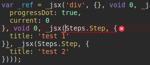

`transform-react-inline-elements` bug reproduction
---------------------------------------------------

`babel-plugin-transform-react-inline-elements` breaks the rendering of children components exposed as a static property (using dot notation).

During my testings, I couldn't reproduce the bug using my own components, only using [`ant-design`](https://github.com/ant-design/ant-design/)'s [`Steps.Step`](https://github.com/ant-design/ant-design/blob/e4d7e5e510173b65fb20d272fd01dabc31ea941d/components/steps/index.tsx#L17) component (investigation needed).
The issue can be avoided by using an indirect reference (by destructuring the child component):

```js
const Step = Steps.Step
const works = (
  <Step>
    {/* Works! */}
  </Step>
)

const doesntWork = (
  <Steps.Step>
    {/* Doesn't work! */}
  </Steps.Step>
)
```

Output
--------

The correct Steps reference is actually `_steps2`, not `Steps`


